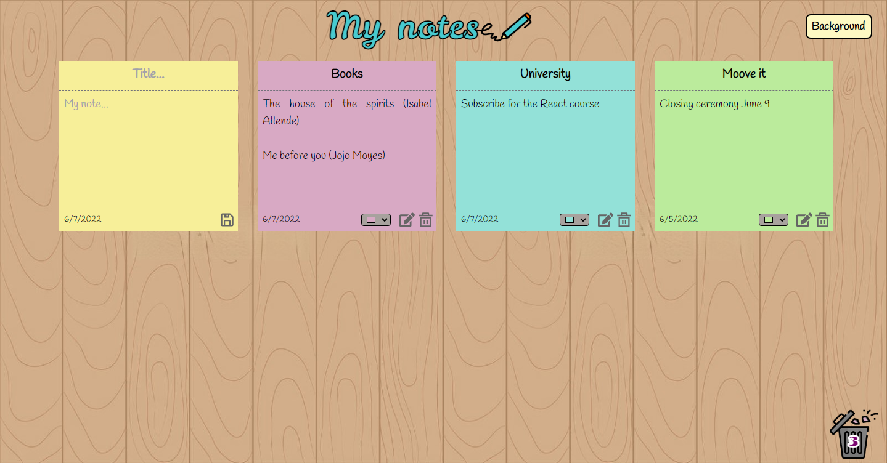

# Post-it notes App :page_facing_up: :pushpin:

The post-it notes application was developed to create notes with a title and body text.
The application has a responsive design, so it can be used on mobile devices as well. It was deployed in Heroku and is available at the link: https://postit-notes-project.herokuapp.com/

This application is the final project of the Bootcamp in Moove it (MooveCamp).
The project applies all the tools seen in the classes like git, Git-Hub, HTML, CSS, JavaScript and
React using Redux, LocalStorage, and React-Router-dom.

## Features :ballot_box_with_check:

- The post-it can be saved without the title.
- If the body text of the post-it is empty, an alert is shown when the save button is clicked.
- The color of the post-it can be changed with some of the colors presets or with other options.
- The background of the application can be changed with the button "Background".
- The post-it created can be edited.
- The post-it can be deleted by sending it to the trash.
- On the trash icon on the Home page, it is possible to see how many post-its have been deleted or if there are no post-its deleted.
- If the empty trash icon is clicked when there are no deleted post-its, an alert is shown.
- The post-it can be restored from the Trash to the Home.
- The post-it can be deleted permanently from the Trash.
- There is an icon on the Trash page to delete all the post-its with a confirmation alert.
- In case the last post-it on the Trash is deleted permanently or restored, by clicking the delete or restore button, the user will be redirected to the Home page.
- On the Trash page there is a button to redirect to the Home page.

## Code Style :paintbrush:

The application follows the airbnb style guide
using eslint to check the file automatically with the
eslint-config-airbnb.

## Technologies :desktop_computer:

### Dependencies

- [Node.js](https://nodejs.org/es/): v18.2.0
- [React](https://reactjs.org/): v18.1.0
- [React Redux](https://react-redux.js.org): v8.0.2. To use global states.
- [Redux Toolkit](https://redux-toolkit.js.org/): v1.8.2 To create a Slice to have all the actions and the reducers together.
- [React Router](https://reactrouter.com/docs/en/v6): v6.3.0. To link the Home and the Trash pages.
- [PropTypes](https://www.npmjs.com/package/prop-types): v15.8.1. To check the types of props to fill the ESLint requirements.
- [React Icons](https://react-icons.github.io/react-icons/): v4.3.1. For the save, edit, restore and delete buttons.
- [sweetalert2](https://sweetalert2.github.io/): v11.4.17. To make alerts with styling.

### Dev Dependencies

- [ESLint](https://eslint.org/docs/user-guide/getting-started): v8.2.0. To check the code styling with the airbnb guide.
- [Prettier](https://prettier.io/docs/en/install.html): v2.6.2. To format the code automatically.
- [Babel](https://www.npmjs.com/package/@babel/core): v7.18.2. To transpile the JS code for the browser.
- [tailwindcss](https://tailwindcss.com/docs/guides/create-react-app): v3.0.24. To make the CSS styling

## Run Locally :arrow_forward:

Clone the project

```bash
  git clone https://github.com/lavilladaa/project-postit-notes.git
```

Go to the project directory

```bash
  cd the-project
```

Install dependencies

```bash
  npm install
```

Start the server

```bash
  npm run start
```

## App screen :pager:



## Contact :pouting_woman:

Created by Laura Villada.

[](https://www.linkedin.com/in/laura-villada-atehortua/)